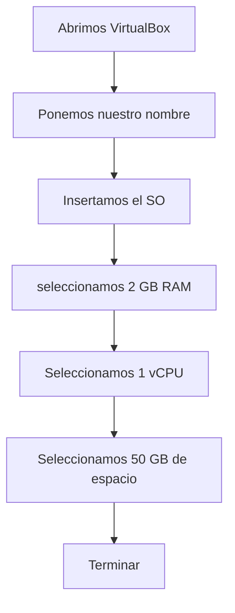

# Actividades de aplicación
## 2.21
Modifica los colores de la consola de PowerShell, el título de la ventana y el prompt. Añade los cambios al fichero del perfil de usuariox

## 2.22

Instala sobre el software de virtualización que estés usando, y donde tengas instalado el servidor, una máquina virtual donde se instale el
sistema operativo Windows 10. Llama a esa máquina virtual Cliente1. Crear máquina nueva → Windows 10. 

Nombre: Cliente1. Asignar: 2 GB RAM minimo 1 vCPU 50 GB de disco Montar ISO de Windows 10 Instalar sistema.

# 2.23
Comprueba la conexión entre las máquinas Cliente1 y Servidor utilizando el comando ping y Test-NetConnection. Ponemos ipconfig para
saber la IP y luego hacemos ping para comprobar conectividad

# 2.24
Crea un usuario local llamado usuariolocal. Haz que sea un usuario estándar y créale una contraseña que él no pueda cambiar. Entra como
usuariolocal e intenta cambiarla. 

