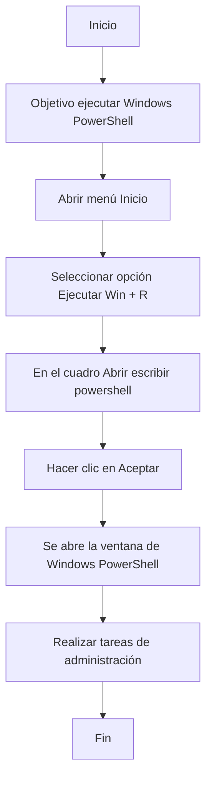

# Comprobación de hardware
El objetivo de esta actividad es pensar en la posibilidad de instalar Microsoft Windows Server 2019 en tu ordenador teniendo en cuenta los requisitos sugeridos.
Microsoft Windows Server 2019 recomienda hardware con ciertas características mínimas:

# Requisitos minimos windows server 2019:
| **Componente**   | **Requisito**                                                   |
|------------------|-----------------------------------------------------------------|
| Procesador       | Al menos necesitarás **1.4 GHz** (procesador x64).              |
| Memoria RAM      | Al menos **512 MB**                                             |
| Hard disk        | Al menos **32 GB**                                              |
| Salida estándar  | Al menos **Super VGA (1024 × 768)**                             |
| Otros            | Teclado y ratones compatibles con Microsoft                     |

 
# Requisitos para un funcionamiento fluido windows server 2019:

| Componente      | Requisito                                                                 |
|-----------------|---------------------------------------------------------------------------|
| Procesador      | **3 GHz** o más                                                           |
| Memoria RAM     | **2 GB** son necesarios para soportar una instalación completa            |
| Hard disk       | **80 GB** para una instalación completa que permita realizar determinadas tareas |
| Salida estándar | Al menos **Super VGA (1024 x 768)**                                       |
| Otros           | Red, teclado y ratones compatibles con Microsoft                          |

# Caracteristicas PC para  server 2019:

| Componente      | Requisito                                                                 |
|-----------------|---------------------------------------------------------------------------|
| Procesador      | **4.90 GHz**                                                           |
| Memoria RAM     | **32 GB**            |
| Hard disk       | **1 TB** |
| Salida estándar | **HDMI (1920 x 1080)**                                       |
| Otros           | Red, teclado y ratones compatibles con Microsoft                          |

# Comprueba las características de tu ordenador y justifica si es recomendable instalar este sistema en tu máquina.
Si si es recomendable ya que cumple tanto requisitos minimos y requisitos recomendados ademas de eso por unas especificaciones bastante mayores el windows server 2019 deberia funcionar sin ningun problema

# Administrar el servidor
El propósito de esta actividad es identificar la información más básica que encontrarás en el sistema operativo Microsoft Windows Server 2019.
Rellena la siguiente pestaña utilizando la herramienta más adecuada para la información que necesitas:

| Informacion del equipo     | Valor |
|----------------------------|-------|
| Nombre completo del equipo | WIN-4R1RLFNOQT1      |
| Dominio o grupo de trabajo | WORKGROUP      |
| CPU y RAM instaladas       | 8 GB y i7 1620h      |
| IP actual                  |  10.0.2.15     |
| Identificador del producto |  00454-40000-00001-AA681     |

La consola de administración del servidor es la herramienta más adecuada para las tareas de administración del sistema. Para abrir esta consola debes seguir los siguientes pasos:

