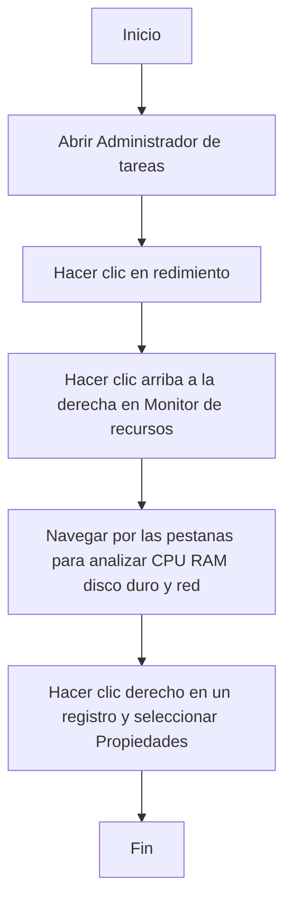
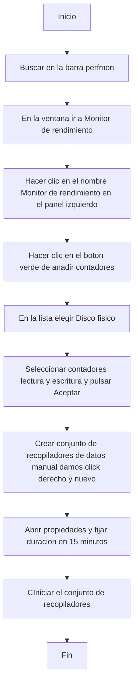

# Monitor de recursos
El objetivo de esta actividad es que trabajes con el Monitor de Recursos. Abra el Monitor de recursos y analice el uso del procesador, la RAM, el disco duro y la red. Todo ello en tiempo real y con gráficos que te ayudan a evaluar el estado actual del sistema.

# Rendimiento del equipo
El objetivo de esta actividad es permitirte estudiar el desempeño de tu equipo y comprobar si funciona de la forma más adecuada.
Abra el monitor de rendimiento y agregue un contador sobre el uso del disco duro: lectura y escritura. Además, configúrelo para analizarlo durante 15 minutos.

