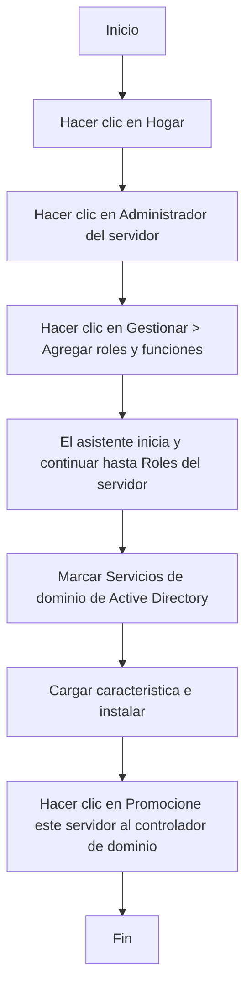
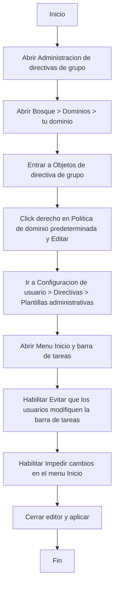

# Creación de un nuevo bosque
Esta práctica consiste en crear un bosque en un sistema Microsoft Windows Server 2019 recién instalado. Indique todos los pasos que debe seguir para abrir el asistente para crear un nuevo dominio.

Aqui ya estaria instalado el servicio y creado el dominio

# Establecer pautas grupales
El propósito de esta actividad es encontrar los pasos correctos para realizar una configuración general en los usuarios del dominio, por ejemplo, que no puedan reorganizar la barra de tareas ni eliminar íconos del menú de inicio. Este tipo de directivas se aplican a todos los usuarios que forman parte del ámbito empresarial.

Esto es lo que debemos hacer 
