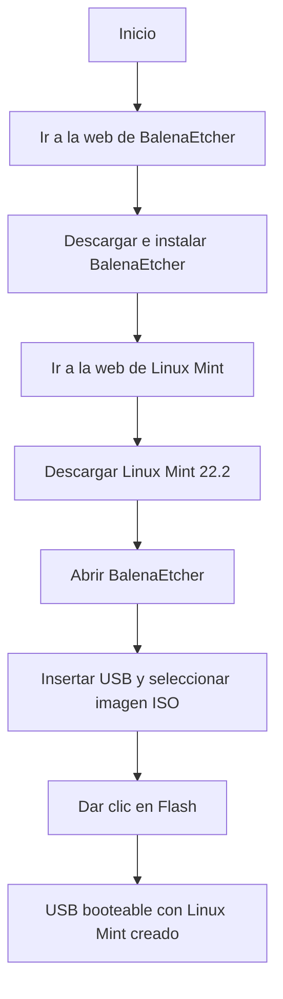
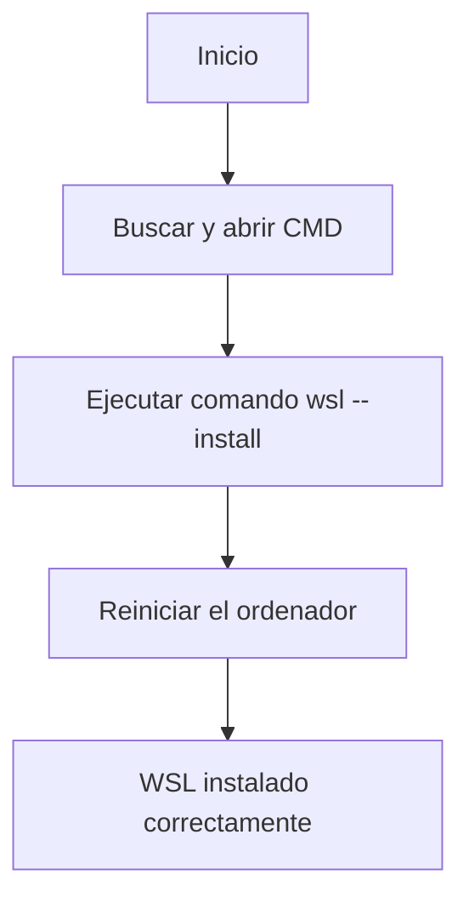

# Hardware Windows 10


```
GodMode.{ED7BA470-8E54-465E-825C-99712043E01C}
```


---

# BalenaEtcher


 


# WSL



# Docker Desktop

 ```mermaid
flowchart TD
    A[Inicio] --> B[Ir a la web de Docker Desktop]
    B --> C[Seleccionar Download Docker Desktop]
    C --> D[Elegir Windows AMD64]
    D --> E[Descargar Docker Desktop]
    E --> F[Instalar Docker Desktop]
    F --> G[Instalación completada]
```


