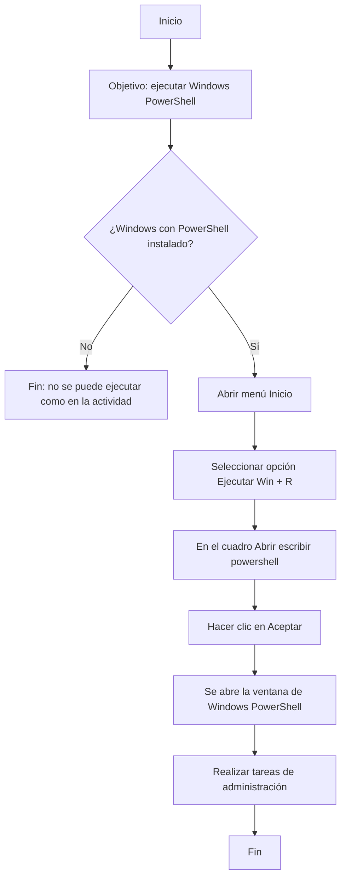

# Requisitos minimos windows server 2019:
| **Componente**   | **Requisito**                                                   |
|------------------|-----------------------------------------------------------------|
| Procesador       | Al menos necesitarás **1.4 GHz** (procesador x64).              |
| Memoria RAM      | Al menos **512 MB**                                             |
| Hard disk        | Al menos **32 GB**                                              |
| Salida estándar  | Al menos **Super VGA (1024 × 768)**                             |
| Otros            | Teclado y ratones compatibles con Microsoft                     |

 
# Requisitos para un funcionamiento fluido windows server 2019:

| Componente      | Requisito                                                                 |
|-----------------|---------------------------------------------------------------------------|
| Procesador      | **3 GHz** o más                                                           |
| Memoria RAM     | **2 GB** son necesarios para soportar una instalación completa            |
| Hard disk       | **80 GB** para una instalación completa que permita realizar determinadas tareas |
| Salida estándar | Al menos **Super VGA (1024 x 768)**                                       |
| Otros           | Red, teclado y ratones compatibles con Microsoft                          |

